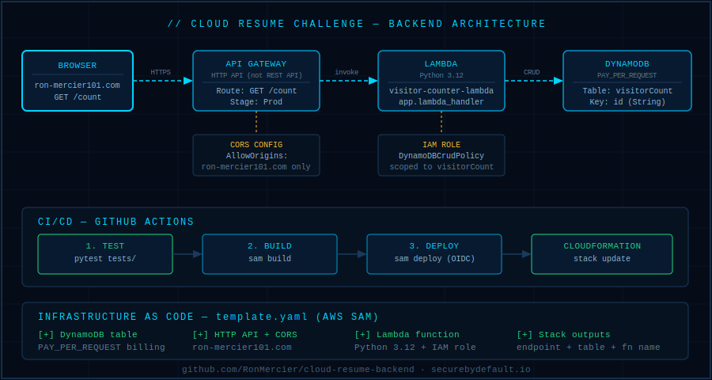

# cloud-resume-backend


**Serverless visitor counter API for the Cloud Resume Challenge — built with AWS Lambda, DynamoDB, API Gateway, AWS SAM, and OIDC-authenticated GitHub Actions CI/CD.**

This is the backend half of the Cloud Resume Challenge. It implements Steps 12–14 of the challenge specification: Infrastructure as Code, a dedicated backend repository, and automated CI/CD for all Lambda and API deployments. No manual console clicks after initial setup.

> 🌐 **Live site:** [ron-mercier101.com](https://ron-mercier101.com)
> 📦 **Frontend repo:** [AWS-S3-Static-Website](https://github.com/RonMercier/AWS-S3-Static-Website)

---

## Architecture



| Layer | Service | Purpose |
|---|---|---|
| **Ingress** | API Gateway (HTTP API) | Exposes `GET /count` with CORS for `ron-mercier101.com` |
| **Logic** | Lambda (Python 3.12) | Reads and increments visitor count atomically |
| **Data** | DynamoDB (PAY_PER_REQUEST) | Single-table design — stores visitor count by `id` key |
| **IaC** | AWS SAM | Defines all resources in `template.yaml` — no console config |
| **CI/CD** | GitHub Actions + OIDC | Test → Build → Deploy on every push to `main` |

---

## API

**Endpoint:** `GET /count`

Returns the current visitor count. Increments atomically on each call.

```json
{
  "count": 247
}
```

**CORS:** Configured for `https://ron-mercier101.com` only. To use with a different domain, update `AllowOrigins` in `template.yaml`.

---

## Repository Structure

```
cloud-resume-backend/
├── src/
│   ├── app.py                # Lambda handler — visitor counter logic
│   └── requirements.txt      # Lambda dependencies (boto3 pre-installed in runtime)
├── tests/
│   └── test_handler.py       # pytest unit tests for the Lambda handler
├── assets/
│   └── architecture.png      # Architecture diagram
├── template.yaml             # SAM template — all IaC defined here
├── samconfig.toml            # SAM deployment config (auto-generated on first deploy)
├── pyproject.toml            # Python project config
├── requirements.txt          # Local dev dependencies (pytest, boto3, etc.)
└── .github/
    └── workflows/
        └── deploy.yml        # GitHub Actions CI/CD pipeline
```

---

## SAM Template — What Gets Deployed

The `template.yaml` defines the entire backend stack. Nothing is created manually in the AWS Console.

**DynamoDB table (`visitorCount`)**
- Billing: `PAY_PER_REQUEST` — scales to zero when idle, no provisioned capacity waste
- Key: `id` (String, HASH) — single-item design for the counter
- Named explicitly to protect against accidental renames via CloudFormation drift

**HTTP API (`HttpApi`)**
- Type: `AWS::Serverless::HttpApi` (HTTP API, not REST API — lower latency, ~70% cheaper)
- Stage: `Prod`
- CORS: `GET` and `OPTIONS` methods, `https://ron-mercier101.com` origin only
- `MaxAge: 3600` — preflight responses cached for 1 hour

**Lambda function (`visitor-counter-lambda`)**
- Runtime: Python 3.12
- Handler: `app.lambda_handler`
- `TABLE_NAME` injected as environment variable via `!Ref VisitorTable`
- IAM: `DynamoDBCrudPolicy` scoped to this table only — no wildcard permissions

**Stack outputs** (printed after every deploy):
```
ApiEndpoint  → https://{id}.execute-api.{region}.amazonaws.com/Prod/count
TableName    → visitorCount
FunctionName → visitor-counter-lambda
```

---

## Technical Decisions

**OIDC instead of stored IAM credentials**

GitHub Actions authenticates to AWS using OpenID Connect — no long-lived access keys stored as GitHub Secrets. The workflow assumes an IAM role scoped to this specific repo and branch. This follows AWS security best practices: credentials are ephemeral, automatically rotated, and can't leak because they were never stored.

**HTTP API over REST API**

API Gateway HTTP API chosen over the older REST API flavor. HTTP API has lower latency, costs approximately 70% less, and supports all features needed here (CORS, Lambda integration, custom domains). REST API's premium features — request validation, caching, usage plans, API keys — are unnecessary for a simple counter endpoint.

**DynamoDB PAY_PER_REQUEST**

On-demand billing eliminates provisioned capacity management. At portfolio traffic volumes, provisioned throughput would sit mostly idle and cost money for nothing. PAY_PER_REQUEST bills per request, scales automatically, and costs nothing when idle. The right choice for a low-traffic project where cost predictability matters more than throughput optimization.

**SAM over raw CloudFormation**

AWS SAM compresses serverless IaC significantly. A Lambda function + HTTP API event source that takes ~60 lines in raw CloudFormation (function, role, API, route, integration, stage, permission) takes ~15 lines in SAM. SAM is a CloudFormation transform — it compiles down to CloudFormation, so there's no lock-in and the full CloudFormation feature set is available when needed.

**Environment variable for table name**

`TABLE_NAME` is passed to Lambda as an environment variable via `!Ref VisitorTable` rather than hardcoded in `app.py`. This means the Lambda code has no knowledge of the specific table name — it reads from the environment. The same code works in any environment (dev, staging, prod) without modification.

---

## CI/CD Pipeline

Every push to `main` runs the full pipeline automatically. No manual deployments.

```
push to main
    │
    ▼
┌─────────────────────────────────────────┐
│  1. TEST                                │
│     pytest tests/                       │
│     Fails here = no deploy              │
└─────────────────────────────────────────┘
    │
    ▼
┌─────────────────────────────────────────┐
│  2. BUILD                               │
│     sam build                           │
│     Compiles Lambda package + deps      │
└─────────────────────────────────────────┘
    │
    ▼
┌─────────────────────────────────────────┐
│  3. DEPLOY                              │
│     sam deploy (non-interactive)        │
│     Assumes IAM role via OIDC           │
│     CloudFormation updates the stack    │
└─────────────────────────────────────────┘
```

**Authentication — OIDC setup:**

The GitHub Actions workflow uses OIDC to assume an IAM role. No AWS credentials are stored in GitHub Secrets. To replicate this setup:

1. Create an IAM OIDC identity provider for `token.actions.githubusercontent.com` in your AWS account
2. Create an IAM role with a trust policy that allows this specific repo to assume it:

```json
{
  "Effect": "Allow",
  "Principal": {
    "Federated": "arn:aws:iam::ACCOUNT_ID:oidc-provider/token.actions.githubusercontent.com"
  },
  "Action": "sts:AssumeRoleWithWebIdentity",
  "Condition": {
    "StringEquals": {
      "token.actions.githubusercontent.com:aud": "sts.amazonaws.com"
    },
    "StringLike": {
      "token.actions.githubusercontent.com:sub": "repo:RonMercier/cloud-resume-backend:ref:refs/heads/main"
    }
  }
}
```

3. Attach the role ARN as a GitHub Actions variable (not a secret — it's not sensitive)
4. In the workflow, use `aws-actions/configure-aws-credentials` with `role-to-assume`

---

## Local Development

**Prerequisites**
- Python 3.12
- AWS SAM CLI
- AWS credentials configured locally (for local deploys — CI uses OIDC)
- Git

**Setup (Fedora/RHEL — adapt package manager for your OS)**

```bash
# Install system dependencies
sudo dnf install -y python3 python3-pip git

# Install SAM CLI
pip install --user aws-sam-cli
echo 'export PATH="$HOME/.local/bin:$PATH"' >> ~/.bashrc && source ~/.bashrc

# Clone and set up
git clone https://github.com/RonMercier/cloud-resume-backend.git
cd cloud-resume-backend

# Create virtual environment
python3.12 -m venv .venv
source .venv/bin/activate
pip install --upgrade pip
pip install -r requirements.txt
```

**Run tests**

```bash
pytest tests/ -v
```

**Build**

```bash
sam build
```

If SAM can't find pip inside the build environment:

```bash
sam build --use-container
```

**First deploy (guided — generates samconfig.toml)**

```bash
sam deploy --guided
```

SAM will prompt for stack name, region, and deployment preferences, then save these to `samconfig.toml` for future runs.

**Subsequent deploys**

```bash
sam deploy
```

**After any deploy, verify the API is working:**

```bash
# Get endpoint from SAM output, then:
curl https://YOUR_API_ENDPOINT/Prod/count
# Expected: {"count": N}
```

---

## Testing

**Unit tests**

```bash
pytest tests/ -v
```

Tests mock the DynamoDB client using `moto` or `unittest.mock` so no real AWS resources are needed to run them.

**Smoke test (post-deploy)**

After any deployment, call the real API endpoint to confirm the full stack is working:

```bash
curl https://YOUR_API_ENDPOINT/Prod/count
```

A valid JSON response with a `count` field confirms Lambda executed, DynamoDB updated, and API Gateway is routing correctly. This is the definitive test that IaC + CI/CD deployed successfully — no amount of unit tests can replicate it.

---

## Deployment Notes

**`samconfig.toml`** is auto-generated on first guided deploy. It stores your stack name, region, S3 bucket for artifacts, and deployment preferences so subsequent `sam deploy` calls are non-interactive.

**`requirements.txt not found, continuing without dependencies`** — this SAM message is normal if `src/requirements.txt` is empty. `boto3` is pre-installed in the Lambda Python runtime and doesn't need to be bundled.

**Stack updates** — CloudFormation performs change detection. Only modified resources are updated. DynamoDB tables are not replaced on schema changes to existing attributes (only additions are safe — removing or changing key attributes requires table replacement and data migration).

---

## Related

- [AWS-S3-Static-Website](https://github.com/RonMercier/AWS-S3-Static-Website) — Frontend counterpart: portfolio site hosted on S3 + CloudFront
- [securebydefault-server-hardening](https://github.com/RonMercier/securebydefault-server-hardening) — Production Linux server hardening configs
- [cloud-security-checklist](https://github.com/RonMercier/cloud-security-checklist) — 28-point security baseline checklist
- [SecureByDefault.io](https://securebydefault.io) — Security engineering blog

---

## About

Built by **Ron Mercier** — Cloud & Cybersecurity Engineer.
Previously: DDoS mitigation and incident response at Akamai Technologies.
MSc Cybersecurity · CySA+ · PenTest+ · ISC2 CC · AWS CCP.

[securebydefault.io](https://securebydefault.io) · [LinkedIn](https://www.linkedin.com/in/ron-mercier) · [GitHub](https://github.com/RonMercier)
